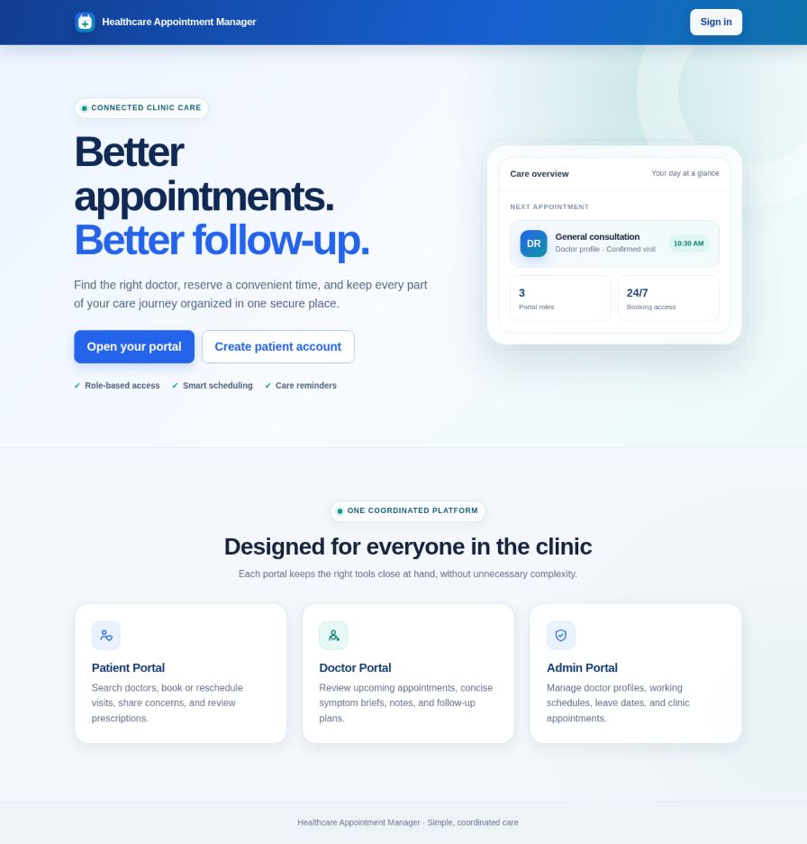
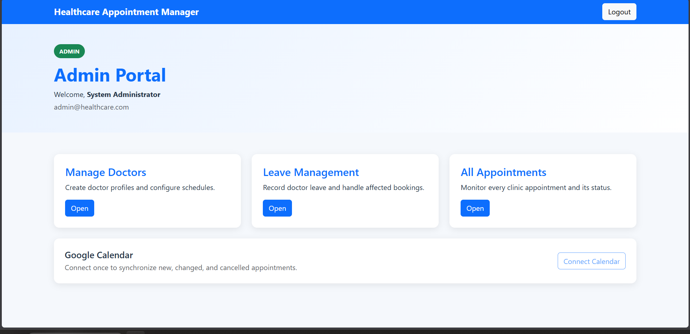
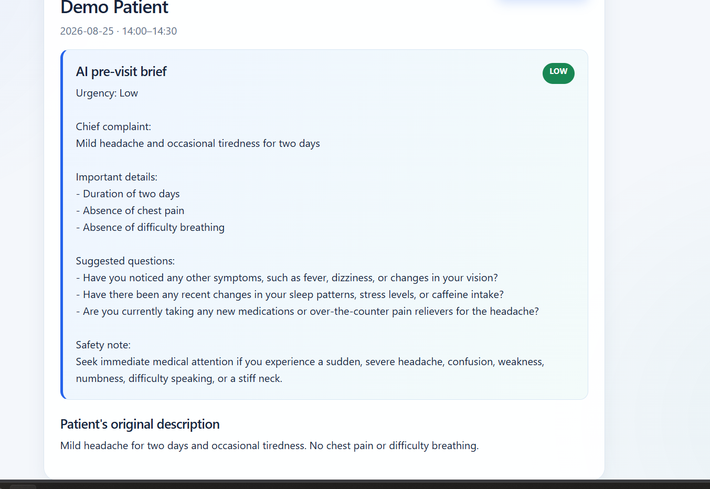
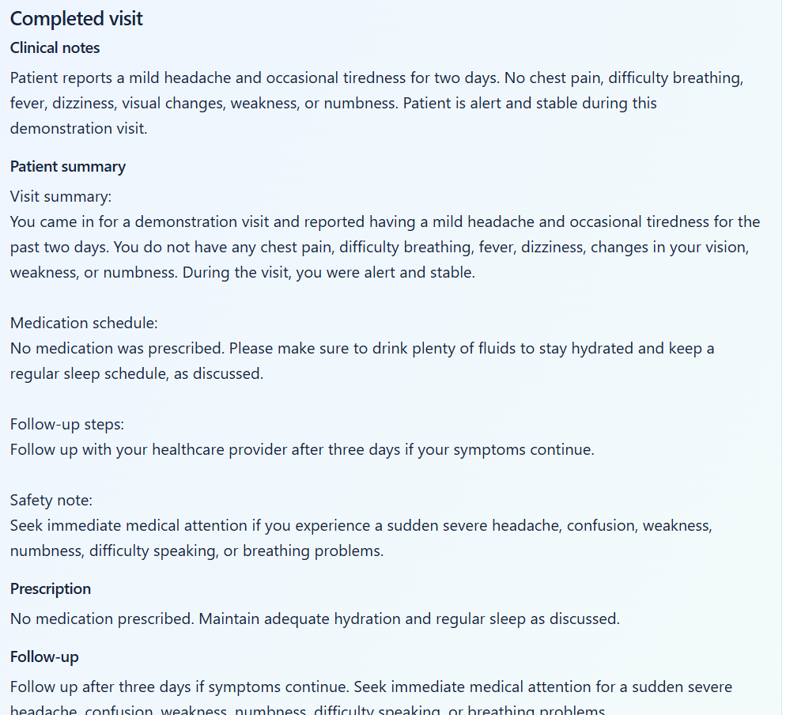

# Project Working and Screenshots

This walkthrough explains the complete flow of the Healthcare Appointment Manager. The application has three secured portals: patient, doctor, and administrator.

## 1. Application entry

Users open the deployed application and select their portal. New patients can create an account, while authorised users can sign in to their role-specific dashboard.

## 2. Administrator workflow

The administrator can:

- create and update doctor profiles;
- configure specialisation, consultation fee, working hours, and slot duration;
- activate or deactivate doctors;
- record doctor leave;
- view appointments across the clinic.

When leave overlaps an active booking, the booking is cancelled, the slot is released, associated calendar events are removed, and notification jobs are queued.

## 3. Patient workflow

The patient can:

1. register and sign in;
2. search for an active doctor by specialisation;
3. choose an available date and time;
4. provide a short description of symptoms;
5. confirm the appointment;
6. view, reschedule, or cancel existing appointments.

The selected slot receives a database-backed five-minute hold before confirmation. A unique reservation constraint and transactional booking logic prevent two users from booking the same doctor and time concurrently.

After confirmation, the application stores the appointment, produces the pre-visit summary, queues email notifications, and synchronizes Google Calendar when the relevant users have connected their accounts.

## 4. Doctor workflow and AI summary

The doctor opens an appointment to see the original patient description and an AI-assisted brief containing:

- urgency level;
- chief complaint;
- important details;
- three suggested questions;
- an emergency safety note.

The summary is assistive and never presented as a diagnosis. Gemini is used when configured; a deterministic safety-focused fallback preserves the workflow if the provider is unavailable.

## 5. Completing a visit

The doctor records clinical notes, prescription details, and follow-up instructions. The application then generates and stores a patient-friendly post-visit summary with a medication schedule, follow-up steps, and safety advice.

Medication reminders are created from structured prescription information. The background worker sends due reminders and retries temporary email failures without rolling back the appointment or visit data.

## 6. Integration behavior

| Integration | Project behavior |
|---|---|
| Gemini AI | Generates pre-visit and post-visit summaries; safe fallback is automatic |
| SendGrid | Sends booking, change, cancellation, and medication reminder emails through a retryable outbox |
| Google Calendar | Creates events for independently connected patients and doctors and updates/removes them after rescheduling or cancellation |
| PostgreSQL | Stores production users, doctor profiles, appointments, summaries, reminders, notification jobs, and Calendar tokens |

For a precise demonstration sequence, see [docs/DEMO_GUIDE.md](docs/DEMO_GUIDE.md). For the original requirement mapping, see [docs/REQUIREMENTS_CHECKLIST.md](docs/REQUIREMENTS_CHECKLIST.md).
